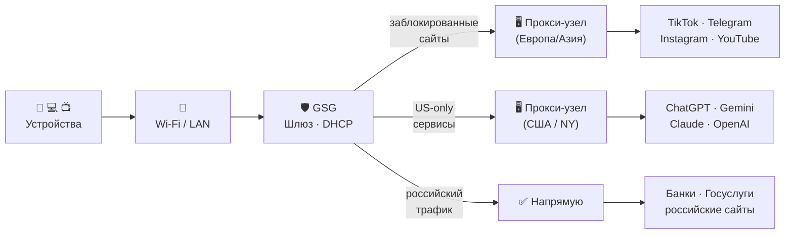

# GlobalShield Gateway (GSG)

**Умный шлюз для обхода блокировок — без VPN на каждом устройстве.**

Подключается один раз в сеть, и все устройства — телефоны, телевизоры, умные колонки — автоматически получают доступ к заблокированным сайтам. Ничего не нужно настраивать на каждом устройстве отдельно.

🌐 **Сайт:** [globalshield.ru](https://globalshield.ru)

---

## Как это работает

GSG подключается к роутеру по кабелю и берёт на себя раздачу IP-адресов (DHCP). Все устройства в сети автоматически получают GSG как шлюз. GSG сам решает, какой трафик пустить через прокси, а какой — напрямую.



---

## Что умеет GSG

| Возможность | Описание |
|-------------|----------|
| 🧠 **Smart-маршрутизация** | Заблокированный трафик через прокси, всё остальное — напрямую |
| 📱 **Режим на устройство** | Каждому устройству свой режим: Smart, Global, Bypass или Block |
| 🌐 **Веб-интерфейс** | Управление с любого браузера. Статистика трафика в реальном времени |
| ⚡ **Прозрачный прокси** | nftables TPROXY — клиентам ничего настраивать не нужно |
| 📦 **Docker Compose** | Все компоненты — изолированные контейнеры. Легко обновлять |
| 🔄 **Watchdog** | Перезагружает устройство при зависании системы |

---

## Компоненты системы

```
┌─────────────────────────────────────────────────────────────┐
│                        GSG Device                           │
│                                                             │
│  ┌──────────────────┐    ┌──────────────────────────────┐  │
│  │  web-orchestrator│    │      tunnel-provider          │  │
│  │  FastAPI + UI    │    │  Mihomo (Clash Meta)          │  │
│  │  Порт :8080      │    │  TPROXY :12345               │  │
│  └──────────────────┘    └──────────────────────────────┘  │
│                                                             │
│  ┌──────────────────┐    ┌──────────────────────────────┐  │
│  │  net-enforcer    │    │      registry-dhcp            │  │
│  │  nftables        │    │  dnsmasq                     │  │
│  │  Перехват трафика│    │  Раздача IP · DNS            │  │
│  └──────────────────┘    └──────────────────────────────┘  │
└─────────────────────────────────────────────────────────────┘
```

| Контейнер | Роль |
|-----------|------|
| `web-orchestrator` | FastAPI + HTML dashboard. Управление всеми настройками |
| `tunnel-provider` | Mihomo (Clash Meta). TPROXY :12345. Загружает подписку и строит правила |
| `net-enforcer` | nftables. Перенаправляет трафик на TPROXY. Управляет bypass-списком |
| `registry-dhcp` | dnsmasq. Раздаёт IP-адреса, регистрирует имена устройств |

---

## Что нужно для установки

- Linux ARM64 / x86_64 (Raspberry Pi, Orange Pi, NanoPi, мини-ПК)
- Debian 11+ / Ubuntu 20.04+ / Armbian
- Права root / sudo
- Устройство должно быть шлюзом (gateway) сети — **2 сетевых порта**
- Подписка GlobalShield (формат Clash / Mihomo)

### Рекомендуемые устройства

| Устройство | Цена | Статус |
|-----------|------|--------|
| **Raspberry Pi 5** (4 GB) | ~6 000 ₽ | ✅ Рекомендуется |
| **Orange Pi 5** (4 GB) | ~5 000 ₽ | ✅ Рекомендуется |
| **NanoPi R3S-LTS** (RK3566, 2 GB) | ~3 500 ₽ | ✅ Рекомендуется |
| Raspberry Pi 4B (4 GB) | ~5 500 ₽ | ✅ Работает |
| NanoPi R5S | ~6 500 ₽ | ✅ Работает |
| NanoPi R2S / R2C (RK3328, 1 GB) | ~2 500 ₽ | ⚠️ Минимум |

> Если у одноплатника один сетевой порт — докупите **USB 3.0 → Ethernet адаптер** (~500–800 ₽).

---

## Установка

### 1. Подписка GlobalShield

👉 Оформить подписку: [@Global_Shield_bot](https://t.me/Global_Shield_bot) в Telegram

После оплаты бот пришлёт URL подписки — его нужно вставить в веб-интерфейс GSG.

### 2. Подготовьте устройство

1. Установите **Debian 12** или **Ubuntu 22.04** (образ без рабочего стола)
2. Подключите устройство к роутеру по кабелю ethernet
3. **Выключите DHCP на роутере** — GSG будет раздавать IP-адреса сам
4. Зайдите по SSH: `ssh root@<IP устройства>`

### 3. Одна команда для установки

```bash
bash <(curl -fsSL https://www.globalshield.ru/install.sh)
```

Скрипт сам установит Docker, настроит сеть, запустит GSG и зарегистрирует устройство. Занимает ~3 минуты.

> **Внимание:** в конце установки IP изменится и SSH-сессия прервётся — это нормально. Новый IP будет показан перед завершением.

---

## Первый запуск

1. Откройте веб-интерфейс: `http://<IP шлюза>:8080`
2. Перейдите в раздел **Подписка и узлы**
3. Вставьте URL подписки от [@Global_Shield_bot](https://t.me/Global_Shield_bot)
4. Нажмите **Обновить** — узлы загрузятся автоматически

---

## Режимы устройств

| Режим | Описание |
|-------|----------|
| 🧠 **Smart** | Заблокированные сайты — через прокси, остальные — напрямую. **Рекомендуется** |
| 🌐 **Global** | Весь трафик через прокси |
| ⚡ **Bypass** | Весь трафик напрямую, прокси не используется |
| 🚫 **Block** | Устройство без доступа к интернету |

---

## Обновление

```bash
bash /root/GSG/install.sh
```

Скрипт подтянет обновления из GitHub и перезапустит сервисы. IP и пароль не изменятся.

---

## Поддержка

- 🌐 Сайт: [globalshield.ru](https://globalshield.ru)
- 🤖 Магазин (Бот): [@Global_Shield_bot](https://t.me/Global_Shield_bot)
- 🛟 Поддержка: [@Global_Shield_support](https://t.me/Global_Shield_support)
