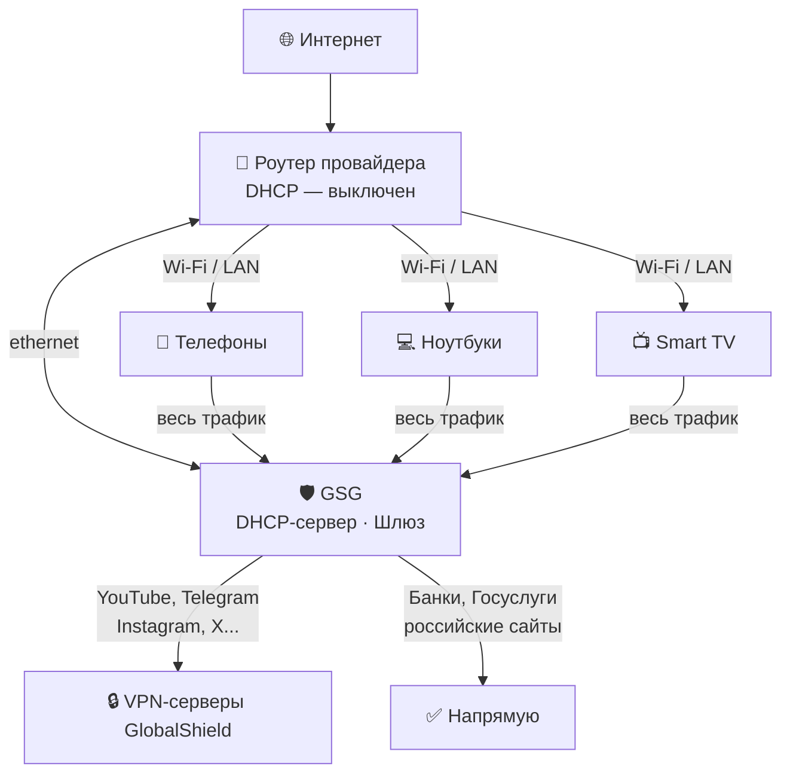

# GlobalShield Gateway (GSG)

**Умный шлюз для обхода блокировок — без VPN на каждом устройстве.**

Подключается один раз в сеть, и все устройства — телефоны, телевизоры, умные колонки — автоматически получают доступ к заблокированным сайтам. Ничего не нужно настраивать на каждом устройстве отдельно.

🌐 **Сайт:** [globalshield.ru](https://globalshield.ru)

---

## Как это работает

GSG подключается к роутеру по кабелю и берёт на себя раздачу IP-адресов (DHCP). Все устройства в сети — телефоны, телевизоры, ноутбуки — автоматически получают GSG как шлюз и начинают работать через него. Ничего не нужно настраивать на каждом устройстве отдельно.

GSG сам решает, какой трафик пустить через VPN, а какой — напрямую. YouTube, Telegram, Instagram работают без ограничений. Российские сайты и банки — напрямую, без VPN.



---

## Что нужно купить

### 1. Подписка GlobalShield

Подписка даёт доступ к VPN-узлам для GSG.

👉 **Оформить подписку:** [@Global_Shield_bot](https://t.me/Global_Shield_bot) в Telegram

После оплаты бот пришлёт URL подписки — его нужно вставить в веб-интерфейс GSG.

### 2. Одноплатный компьютер

GSG работает на любом одноплатнике под управлением Linux.

| Устройство | Цена | Статус |
|-----------|------|--------|
| **Raspberry Pi 5** (4 GB) | ~6 000 ₽ | ✅ Рекомендуется |
| **Orange Pi 5** (4 GB) | ~5 000 ₽ | ✅ Рекомендуется |
| Raspberry Pi 4B (4 GB) | ~5 500 ₽ | ✅ Работает |
| NanoPi R5S | ~6 500 ₽ | ✅ Работает |

**Минимальные требования:** 4 ядра, 2 GB RAM, 8 GB хранилище, **2 сетевых порта**.

> Если у вашего одноплатника один сетевой порт — докупите **USB 3.0 → Ethernet адаптер** (~500–800 ₽).

---

## Установка

### Подготовка

1. Установите **Debian 12** или **Ubuntu 22.04** на одноплатник (образ без рабочего стола)
2. Подключите одноплатник к роутеру по кабелю ethernet
3. **Выключите DHCP на роутере** — GSG будет раздавать IP-адреса сам
4. Зайдите по SSH: `ssh root@<IP одноплатника>`

### Одна команда для установки

```bash
bash <(curl -fsSL https://www.globalshield.ru/install.sh)
```

Скрипт сам:
- Клонирует репозиторий и установит Docker
- Настроит сеть и запустит GSG
- Зарегистрирует устройство
- Сгенерирует пароль для веб-интерфейса

> **Внимание:** в конце установки IP устройства изменится и SSH-сессия прервётся — это нормально. Новый IP будет показан перед завершением.

> После переподключения откройте веб-интерфейс по новому адресу.

---

## Первый запуск

1. Откройте веб-интерфейс: `http://<IP шлюза>:8080`
2. Перейдите в раздел **Подписка и узлы**
3. Вставьте URL подписки от [@Global_Shield_bot](https://t.me/Global_Shield_bot)
4. Нажмите **Обновить** — узлы загрузятся автоматически

### Подключение устройств к сети

После установки устройства получат IP-адреса от GSG автоматически. Роутер продолжает раздавать Wi-Fi — просто его DHCP выключен, а функцию шлюза выполняет GSG.

---

## Управление устройствами

В веб-интерфейсе каждое устройство можно настроить индивидуально:

| Режим | Описание |
|-------|----------|
| **Smart** | Заблокированные сайты — через VPN, остальные — напрямую |
| **Глобальный** | Весь трафик через VPN |
| **Bypass** | Весь трафик напрямую, VPN не используется |
| **Блокировка** | Устройство без доступа к интернету |

---

## Обновление

```bash
bash /root/GSG/install.sh
```

Скрипт подтянет обновления из GitHub и перезапустит сервисы. IP и пароль не изменятся.

---

## Поддержка

- 🌐 Сайт: [globalshield.ru](https://globalshield.ru)
- 🤖 Магазин (Бот): [@Global_Shield_bot](https://t.me/Global_Shield_bot)
- 🛟 Поддержка: [@Global_Shield_support](https://t.me/Global_Shield_support)
